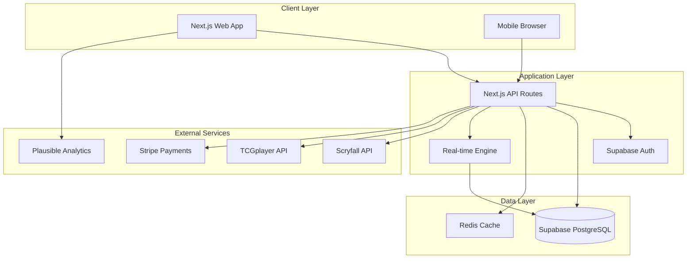

# Design Document

## Overview

TradeEqualizer is a mobile-first Progressive Web App (PWA) built with Next.js that facilitates MTG card trading through intelligent matching algorithms. The P0 MVP is scoped to MTG-only with USD pricing from TCGplayer Market to ensure rapid pilot deployment. The system uses a modern tech stack including Next.js App Router, TypeScript, Supabase for authentication and database, Stripe for payments, and integrates with Scryfall and TCGplayer APIs for card data and pricing.

The architecture follows a mobile-first, offline-capable approach with PWA features including service workers, app-like installation, and basic offline functionality for P0. Enhanced offline features, push notifications, and multi-TCG support are planned for P1/P2 phases. The serverless backend handles business logic through API routes, provides real-time capabilities for trading sessions, and delivers a native app-like experience optimized primarily for mobile devices with desktop as a secondary consideration.

## Architecture

### High-Level Architecture



### System Components

1. **Frontend (Next.js App Router PWA)**
   - Mobile-first responsive design with touch-optimized interfaces
   - Progressive Web App with service worker for offline functionality
   - App-like installation on mobile devices (Add to Home Screen)
   - Server-side rendering for SEO and performance
   - Client-side routing for smooth UX
   - Real-time updates via WebSocket connections
   - Push notifications for trade updates and event announcements
   - Offline data caching for inventory and want lists
   - Camera integration for QR code scanning

2. **Backend API (Next.js API Routes)**
   - RESTful endpoints for CRUD operations
   - WebSocket handlers for real-time trading
   - Background jobs for price updates
   - Rate limiting and security middleware

3. **Database (Supabase PostgreSQL)**
   - Relational data with proper indexing
   - Row-level security policies
   - Real-time subscriptions
   - Automated backups

4. **Caching Layer (Redis)**
   - Price data caching
   - Session management
   - Match algorithm optimization
   - Rate limiting counters

## Components and Interfaces

### Core Models

```typescript
// User Management
interface User {
  id: string;
  email: string;
  name: string;
  createdAt: Date;
  subscriptionTier: 'free' | 'pro' | 'lgs';
  subscriptionExpiresAt?: Date;
}

// Card Catalog (P0: MTG-only)
interface Item {
  id: string;
  game: 'mtg'; // P0 scope: MTG only, expand to 'pokemon' | 'yugioh' | 'lorcana' in P1/P2
  name: string;
  set: string;
  collectorNumber: string;
  language: string;
  finish: 'normal' | 'foil' | 'etched' | 'showcase';
  scryfallId?: string;
  tcgplayerId?: string;
  imageUrl?: string;
  searchVector: string; // For full-text search
}

// User Inventory
interface Inventory {
  id: string;
  userId: string;
  itemId: string;
  quantity: number;
  condition: 'NM' | 'LP' | 'MP' | 'HP';
  language: string;
  finish: 'normal' | 'foil' | 'etched' | 'showcase';
  tradable: boolean;
  acquiredAt: Date;
}

// Want Lists
interface Want {
  id: string;
  userId: string;
  itemId: string;
  quantity: number;
  minCondition: 'NM' | 'LP' | 'MP' | 'HP';
  languageOk: string[]; // Accepted languages
  finishOk: ('normal' | 'foil' | 'etched' | 'showcase')[];
  priority: 1 | 2 | 3; // 1 = Must have, 2 = Want, 3 = Nice to have
  createdAt: Date;
}

// Pricing Data (P0: TCGplayer Market, USD only)
interface Price {
  id: string;
  itemId: string;
  source: 'tcgplayer_market'; // P0 scope: Market only, expand to 'tcgplayer_low' | 'store_buylist' | 'manual' in P1/P2
  currency: 'USD'; // P0 scope: USD only, expand to 'EUR' in P2
  market: number;
  low: number;
  high: number;
  conditionMultipliers: {
    NM: number;
    LP: number;
    MP: number;
    HP: number;
  };
  finishMultipliers: {
    normal: number;
    foil: number;
    etched: number;
    showcase: number;
  };
  version: string; // Price snapshot version for audit trail
  asOf: Date;
}

// Trading Sessions (P0: Enhanced security with single-use tokens)
interface TradeSession {
  id: string;
  qrCode: string; // Single-use token, TTL ≤ 2 minutes, rate-limited 10/min/IP
  userAId: string;
  userBId?: string;
  game: 'mtg'; // P0 scope: MTG only
  priceSource: 'tcgplayer_market'; // P0 scope: Market only
  fairnessThreshold: number; // Default ±5%, configurable ±2-10% in P1
  currency: 'USD'; // P0 scope: USD only
  status: 'waiting' | 'connected' | 'proposing' | 'completed' | 'cancelled';
  eventId?: string;
  expiresAt: Date; // TTL ≤ 2 minutes for QR codes
  createdAt: Date;
}

// Trade Proposals
interface TradeProposal {
  id: string;
  sessionId: string;
  proposedBy: string;
  itemsFromA: TradeItem[];
  itemsFromB: TradeItem[];
  valueA: number;
  valueB: number;
  coverageScore: number;
  status: 'pending' | 'accepted' | 'rejected';
  createdAt: Date;
}

interface TradeItem {
  inventoryId: string;
  itemId: string;
  quantity: number;
  condition: string;
  language: string;
  finish: string;
  unitPrice: number;
  totalValue: number;
  priceOverride?: number; // Manual price adjustment
  priceVersion: string; // Price snapshot version used
}

// Events (LGS) - P0: MTG-only with enhanced privacy
interface Event {
  id: string;
  name: string;
  code: string;
  createdBy: string;
  game: 'mtg'; // P0 scope: MTG only
  defaultPriceSource: 'tcgplayer_market'; // P0 scope: Market only
  fairnessThreshold: number; // Default ±5%, configurable in P1
  startDate: Date;
  endDate: Date;
  isActive: boolean;
  kioskMode: boolean;
}

interface EventMember {
  eventId: string;
  userId: string;
  visibility: 'private' | 'event'; // Default private, explicit opt-in required
  consentToContact: boolean; // P1: Explicit consent for contact sharing
  visibilityExpiresAt: Date; // Auto-expire +2h after event end
  joinedAt: Date;
}
```

### API Endpoints

```typescript
// Authentication (handled by Supabase)
POST /api/auth/callback
GET  /api/auth/user

// Inventory Management
GET    /api/inventory
POST   /api/inventory
PUT    /api/inventory/:id
DELETE /api/inventory/:id
POST   /api/inventory/import-csv

// Want Lists
GET    /api/wants
POST   /api/wants
PUT    /api/wants/:id
DELETE /api/wants/:id

// Card Catalog
GET /api/cards/search?q={query}&limit={limit}
GET /api/cards/:id

// Trading
POST /api/trades/create-session
POST /api/trades/join/:qrCode
GET  /api/trades/session/:id
POST /api/trades/propose
POST /api/trades/accept/:proposalId
GET  /api/trades/matches/:sessionId

// Events
POST /api/events
GET  /api/events/:code/join
GET  /api/events/:id/members
GET  /api/events/:id/matches

// Pricing
GET /api/prices/:itemId
POST /api/admin/sync-prices

// Billing
POST /api/billing/create-checkout
POST /api/billing/webhook
GET  /api/billing/portal

// Data Management
GET  /api/user/export
POST /api/user/delete-account

// Multi-TCG & Price Sources
GET  /api/games
GET  /api/price-sources/:game
POST /api/trades/create-session (with game and priceSource params)

// Admin & Monitoring
GET  /api/health
GET  /api/admin/audit-logs
GET  /api/admin/metrics
POST /api/admin/feature-flags
GET  /api/admin/backups

// LGS Buylist Management
POST /api/lgs/buylist/upload
GET  /api/lgs/buylist
PUT  /api/lgs/buylist/:itemId
DELETE /api/lgs/buylist/:itemId

// Notifications (Pro)
POST /api/notifications/subscribe
GET  /api/notifications/preferences
POST /api/events/:id/send-reminder

// Currency & Regional
GET  /api/currencies
GET  /api/exchange-rates

// Concurrency Control
POST /api/trades/reserve-items
DELETE /api/trades/release-reservations/:sessionId

// WebSocket Events
WS /api/socket
- trade:session:update
- trade:proposal:new
- trade:proposal:accepted
- event:matches:update
```

## Data Models

### Database Schema

```sql
-- Users table (managed by Supabase Auth)
CREATE TABLE users (
  id UUID PRIMARY KEY DEFAULT gen_random_uuid(),
  email TEXT UNIQUE NOT NULL,
  name TEXT,
  subscription_tier TEXT DEFAULT 'free',
  subscription_expires_at TIMESTAMPTZ,
  created_at TIMESTAMPTZ DEFAULT NOW(),
  updated_at TIMESTAMPTZ DEFAULT NOW()
);

-- Items (Card Catalog) - P0: MTG-only
CREATE TABLE items (
  id UUID PRIMARY KEY DEFAULT gen_random_uuid(),
  game TEXT NOT NULL DEFAULT 'mtg' CHECK (game = 'mtg'), -- P0 scope: MTG only
  name TEXT NOT NULL,
  set_code TEXT NOT NULL,
  collector_number TEXT NOT NULL,
  language TEXT DEFAULT 'en',
  finish TEXT DEFAULT 'normal' CHECK (finish IN ('normal', 'foil', 'etched', 'showcase')),
  scryfall_id UUID,
  tcgplayer_id INTEGER,
  image_url TEXT,
  search_vector tsvector,
  created_at TIMESTAMPTZ DEFAULT NOW(),
  UNIQUE(scryfall_id),
  UNIQUE(tcgplayer_id)
);

-- Full-text search index
CREATE INDEX items_search_idx ON items USING GIN(search_vector);
CREATE INDEX items_name_idx ON items(name);
CREATE INDEX items_set_idx ON items(set_code);

-- User Inventory
CREATE TABLE inventory (
  id UUID PRIMARY KEY DEFAULT gen_random_uuid(),
  user_id UUID REFERENCES users(id) ON DELETE CASCADE,
  item_id UUID REFERENCES items(id) ON DELETE CASCADE,
  quantity INTEGER NOT NULL CHECK (quantity > 0),
  condition TEXT NOT NULL CHECK (condition IN ('NM', 'LP', 'MP', 'HP')),
  language TEXT DEFAULT 'en',
  finish TEXT DEFAULT 'normal' CHECK (finish IN ('normal', 'foil', 'etched', 'showcase')),
  tradable BOOLEAN DEFAULT TRUE,
  acquired_at TIMESTAMPTZ DEFAULT NOW(),
  created_at TIMESTAMPTZ DEFAULT NOW(),
  updated_at TIMESTAMPTZ DEFAULT NOW()
);

CREATE INDEX inventory_user_idx ON inventory(user_id);
CREATE INDEX inventory_tradable_idx ON inventory(user_id, tradable) WHERE tradable = TRUE;

-- Want Lists
CREATE TABLE wants (
  id UUID PRIMARY KEY DEFAULT gen_random_uuid(),
  user_id UUID REFERENCES users(id) ON DELETE CASCADE,
  item_id UUID REFERENCES items(id) ON DELETE CASCADE,
  quantity INTEGER NOT NULL CHECK (quantity > 0),
  min_condition TEXT NOT NULL CHECK (min_condition IN ('NM', 'LP', 'MP', 'HP')),
  language_ok TEXT[] DEFAULT ARRAY['en'],
  finish_ok TEXT[] DEFAULT ARRAY['normal', 'foil', 'etched', 'showcase'],
  priority INTEGER NOT NULL CHECK (priority IN (1, 2, 3)),
  created_at TIMESTAMPTZ DEFAULT NOW(),
  UNIQUE(user_id, item_id)
);

CREATE INDEX wants_user_idx ON wants(user_id);
CREATE INDEX wants_priority_idx ON wants(user_id, priority);

-- Pricing Data - P0: TCGplayer Market, USD only
CREATE TABLE prices (
  id UUID PRIMARY KEY DEFAULT gen_random_uuid(),
  item_id UUID REFERENCES items(id) ON DELETE CASCADE,
  source TEXT NOT NULL DEFAULT 'tcgplayer_market' CHECK (source = 'tcgplayer_market'), -- P0 scope: Market only
  currency TEXT DEFAULT 'USD' CHECK (currency = 'USD'), -- P0 scope: USD only
  market DECIMAL(10,2),
  low DECIMAL(10,2),
  high DECIMAL(10,2),
  condition_multipliers JSONB DEFAULT '{"NM": 1.0, "LP": 0.9, "MP": 0.75, "HP": 0.5}', -- Updated defaults from v1.1
  finish_multipliers JSONB DEFAULT '{"normal": 1.0, "foil": 1.5, "etched": 1.3, "showcase": 1.2}',
  version TEXT NOT NULL, -- Price snapshot version for audit trail
  as_of TIMESTAMPTZ NOT NULL,
  created_at TIMESTAMPTZ DEFAULT NOW(),
  UNIQUE(item_id, source, as_of)
);

CREATE INDEX prices_item_idx ON prices(item_id);
CREATE INDEX prices_date_idx ON prices(as_of DESC);

-- Trade Sessions - P0: Enhanced security with single-use tokens
CREATE TABLE trade_sessions (
  id UUID PRIMARY KEY DEFAULT gen_random_uuid(),
  qr_code TEXT UNIQUE NOT NULL, -- Single-use token, TTL ≤ 2 minutes
  user_a_id UUID REFERENCES users(id) ON DELETE CASCADE,
  user_b_id UUID REFERENCES users(id) ON DELETE CASCADE,
  game TEXT NOT NULL DEFAULT 'mtg' CHECK (game = 'mtg'), -- P0 scope: MTG only
  price_source TEXT NOT NULL DEFAULT 'tcgplayer_market' CHECK (price_source = 'tcgplayer_market'), -- P0 scope
  fairness_threshold DECIMAL(5,2) DEFAULT 5.0, -- Default ±5%
  currency TEXT DEFAULT 'USD' CHECK (currency = 'USD'), -- P0 scope: USD only
  status TEXT DEFAULT 'waiting' CHECK (status IN ('waiting', 'connected', 'proposing', 'completed', 'cancelled')),
  event_id UUID REFERENCES events(id) ON DELETE SET NULL,
  expires_at TIMESTAMPTZ NOT NULL, -- TTL ≤ 2 minutes for QR codes
  created_at TIMESTAMPTZ DEFAULT NOW(),
  updated_at TIMESTAMPTZ DEFAULT NOW()
);

CREATE INDEX trade_sessions_qr_idx ON trade_sessions(qr_code);
CREATE INDEX trade_sessions_users_idx ON trade_sessions(user_a_id, user_b_id);
CREATE INDEX trade_sessions_event_idx ON trade_sessions(event_id);

-- Events
CREATE TABLE events (
  id UUID PRIMARY KEY DEFAULT gen_random_uuid(),
  name TEXT NOT NULL,
  code TEXT UNIQUE NOT NULL,
  created_by UUID REFERENCES users(id) ON DELETE CASCADE,
  start_date TIMESTAMPTZ NOT NULL,
  end_date TIMESTAMPTZ NOT NULL,
  is_active BOOLEAN DEFAULT TRUE,
  kiosk_mode BOOLEAN DEFAULT FALSE,
  created_at TIMESTAMPTZ DEFAULT NOW()
);

CREATE INDEX events_code_idx ON events(code);
CREATE INDEX events_active_idx ON events(is_active) WHERE is_active = TRUE;

-- Audit Logs
CREATE TABLE audit_logs (
  id UUID PRIMARY KEY DEFAULT gen_random_uuid(),
  user_id UUID REFERENCES users(id) ON DELETE SET NULL,
  action TEXT NOT NULL,
  resource_type TEXT NOT NULL,
  resource_id TEXT,
  details JSONB,
  ip_address INET,
  user_agent TEXT,
  created_at TIMESTAMPTZ DEFAULT NOW()
);

CREATE INDEX audit_logs_user_idx ON audit_logs(user_id);
CREATE INDEX audit_logs_action_idx ON audit_logs(action);
CREATE INDEX audit_logs_created_idx ON audit_logs(created_at DESC);

-- User Usage Tracking
CREATE TABLE user_usage (
  id UUID PRIMARY KEY DEFAULT gen_random_uuid(),
  user_id UUID REFERENCES users(id) ON DELETE CASCADE,
  date DATE NOT NULL,
  inventory_count INTEGER DEFAULT 0,
  wants_count INTEGER DEFAULT 0,
  suggestions_count INTEGER DEFAULT 0,
  events_created INTEGER DEFAULT 0,
  created_at TIMESTAMPTZ DEFAULT NOW(),
  UNIQUE(user_id, date)
);

CREATE INDEX user_usage_user_date_idx ON user_usage(user_id, date);

-- Item Reservations (concurrency control)
CREATE TABLE item_reservations (
  id UUID PRIMARY KEY DEFAULT gen_random_uuid(),
  inventory_id UUID REFERENCES inventory(id) ON DELETE CASCADE,
  session_id UUID REFERENCES trade_sessions(id) ON DELETE CASCADE,
  quantity INTEGER NOT NULL,
  reserved_at TIMESTAMPTZ DEFAULT NOW(),
  expires_at TIMESTAMPTZ NOT NULL,
  UNIQUE(inventory_id, session_id)
);

CREATE INDEX item_reservations_expires_idx ON item_reservations(expires_at);
CREATE INDEX item_reservations_inventory_idx ON item_reservations(inventory_id);

-- QR Code Rate Limiting - P0: 10/min/IP security requirement
CREATE TABLE qr_rate_limits (
  id UUID PRIMARY KEY DEFAULT gen_random_uuid(),
  ip_address INET NOT NULL,
  created_count INTEGER DEFAULT 1,
  window_start TIMESTAMPTZ DEFAULT NOW(),
  created_at TIMESTAMPTZ DEFAULT NOW(),
  UNIQUE(ip_address, window_start)
);

CREATE INDEX qr_rate_limits_ip_window_idx ON qr_rate_limits(ip_address, window_start);
CREATE INDEX qr_rate_limits_window_idx ON qr_rate_limits(window_start) WHERE window_start > NOW() - INTERVAL '1 minute';

-- Completed Trades (immutable audit trail)
CREATE TABLE completed_trades (
  id UUID PRIMARY KEY DEFAULT gen_random_uuid(),
  session_id UUID REFERENCES trade_sessions(id),
  user_a_id UUID REFERENCES users(id),
  user_b_id UUID REFERENCES users(id),
  items_from_a JSONB NOT NULL, -- Immutable snapshot with printing details
  items_from_b JSONB NOT NULL, -- Immutable snapshot with printing details
  value_a DECIMAL(10,2) NOT NULL,
  value_b DECIMAL(10,2) NOT NULL,
  currency TEXT NOT NULL,
  price_source TEXT NOT NULL,
  price_version TEXT NOT NULL,
  fairness_threshold DECIMAL(5,2) NOT NULL,
  manual_overrides JSONB, -- Any manual price adjustments
  receipt_generated BOOLEAN DEFAULT FALSE,
  completed_at TIMESTAMPTZ DEFAULT NOW()
);

-- LGS Buylist Data
CREATE TABLE lgs_buylists (
  id UUID PRIMARY KEY DEFAULT gen_random_uuid(),
  lgs_user_id UUID REFERENCES users(id) ON DELETE CASCADE,
  item_id UUID REFERENCES items(id) ON DELETE CASCADE,
  sku TEXT,
  price DECIMAL(10,2) NOT NULL,
  condition_multipliers JSONB DEFAULT '{"NM": 1.0, "LP": 0.9, "MP": 0.75, "HP": 0.5}',
  currency TEXT DEFAULT 'USD',
  updated_at TIMESTAMPTZ DEFAULT NOW(),
  UNIQUE(lgs_user_id, item_id, sku)
);

CREATE INDEX completed_trades_users_idx ON completed_trades(user_a_id, user_b_id);
CREATE INDEX completed_trades_date_idx ON completed_trades(completed_at DESC);
```

### Match Algorithm Design

The core matching algorithm follows a coverage-first approach:

```typescript
interface MatchAlgorithm {
  findMatches(userA: string, userB: string, eventId?: string): Promise<TradeProposal[]>;
}

class CoverageFirstMatcher implements MatchAlgorithm {
  async findMatches(userA: string, userB: string, eventId?: string): Promise<TradeProposal[]> {
    // 1. Get tradable inventory for both users
    const inventoryA = await this.getTradableInventory(userA);
    const inventoryB = await this.getTradableInventory(userB);
    
    // 2. Get want lists with priorities
    const wantsA = await this.getWantList(userA);
    const wantsB = await this.getWantList(userB);
    
    // 3. Find intersection: A wants what B has, B wants what A has
    const matchesAtoB = this.findIntersection(wantsA, inventoryB);
    const matchesBtoA = this.findIntersection(wantsB, inventoryA);
    
    // 4. Generate trade combinations prioritizing high-priority wants
    const proposals = this.generateProposals(matchesAtoB, matchesBtoA);
    
    // 5. Filter by fairness constraints (±5% or ±$1.50)
    const fairProposals = proposals.filter(p => this.isFairTrade(p));
    
    // 6. Add make-it-even suggestions for imbalanced trades
    const balancedProposals = await this.addMakeItEvenSuggestions(fairProposals);
    
    // 7. Score by coverage and return top 5
    return balancedProposals
      .sort((a, b) => b.coverageScore - a.coverageScore)
      .slice(0, 5);
  }
  
  private calculateCoverageScore(proposal: TradeProposal): number {
    // Weight by priority: Must=10, Want=5, Nice=1
    const priorityWeights = { 1: 10, 2: 5, 3: 1 };
    
    let score = 0;
    // Add coverage points for each satisfied want
    proposal.itemsFromA.forEach(item => {
      const want = this.findWantForItem(proposal.userBId, item.itemId);
      if (want) {
        score += priorityWeights[want.priority] * item.quantity;
      }
    });
    
    proposal.itemsFromB.forEach(item => {
      const want = this.findWantForItem(proposal.userAId, item.itemId);
      if (want) {
        score += priorityWeights[want.priority] * item.quantity;
      }
    });
    
    return score;
  }
  
  private isFairTrade(proposal: TradeProposal): boolean {
    const diff = Math.abs(proposal.valueA - proposal.valueB);
    const avgValue = (proposal.valueA + proposal.valueB) / 2;
    
    return diff <= 1.50 || (diff / avgValue) <= 0.05;
  }
}
```

## Error Handling

### API Error Responses

```typescript
interface APIError {
  error: string;
  message: string;
  code: string;
  details?: any;
}

// Standard error codes
enum ErrorCodes {
  VALIDATION_ERROR = 'VALIDATION_ERROR',
  NOT_FOUND = 'NOT_FOUND',
  UNAUTHORIZED = 'UNAUTHORIZED',
  RATE_LIMITED = 'RATE_LIMITED',
  EXTERNAL_API_ERROR = 'EXTERNAL_API_ERROR',
  TRADE_SESSION_EXPIRED = 'TRADE_SESSION_EXPIRED',
  INSUFFICIENT_INVENTORY = 'INSUFFICIENT_INVENTORY',
  SUBSCRIPTION_REQUIRED = 'SUBSCRIPTION_REQUIRED'
}
```

### Error Handling Strategy

1. **Client-Side Errors**
   - Form validation with real-time feedback
   - Network error retry with exponential backoff
   - Graceful degradation for offline scenarios
   - User-friendly error messages

2. **Server-Side Errors**
   - Structured error logging without PII
   - Rate limiting with clear error messages
   - External API failure fallbacks
   - Database transaction rollbacks

3. **Real-Time Errors**
   - WebSocket reconnection logic
   - Session state recovery
   - Conflict resolution for concurrent trades

## Testing Strategy

### Manual Testing Focus
- Prioritize manual testing over automated unit tests for rapid development
- Focus on end-to-end functionality validation through browser testing
- Emphasize early feedback loops through local development testing

### Integration Testing (End of Development Cycle)
- API endpoint functionality validation
- Database operations verification
- External API integrations testing
- Authentication flows validation

### End-to-End Manual Testing
- Complete trade flow (QR → match → receipt) on mobile devices
- CSV import functionality on mobile and desktop
- Event creation and joining via mobile interface
- Payment processing on mobile browsers
- PWA installation and offline functionality
- Push notification delivery and handling
- Camera-based QR code scanning
- Touch gesture interactions and mobile UX flows

### Performance Validation
- Match algorithm performance with large datasets
- Database query optimization verification
- API response times under load testing
- WebSocket connection limits validation

### Security Validation
- Authentication and authorization testing
- Input validation and sanitization verification
- Rate limiting effectiveness testing
- PII protection in logs validation

### Test Data Management
- Seeded test database with realistic card data
- Mock external API responses for development
- Local development environment setup
- Manual test scenario documentation

## PWA Implementation Details

### Service Worker Strategy
```typescript
// Service worker for offline functionality and caching
const CACHE_NAME = 'trade-equalizer-v1';
const OFFLINE_URLS = [
  '/',
  '/inventory',
  '/wants',
  '/offline',
  '/manifest.json'
];

// Cache-first strategy for static assets
// Network-first strategy for API calls with offline fallback
// Background sync for trade proposals when connection restored
```

### Mobile-First Design Principles
- **Touch-First Interface**: Large tap targets (44px minimum), swipe gestures for navigation
- **Thumb-Friendly Layout**: Critical actions within thumb reach on mobile screens
- **Responsive Breakpoints**: Mobile (320px+), Tablet (768px+), Desktop (1024px+)
- **Performance Budget**: <3s load time on 3G, <100KB critical path CSS
- **Offline Capability**: Core functionality available without network connection

### PWA Manifest Configuration
```json
{
  "name": "TradeEqualizer",
  "short_name": "TradeEQ",
  "description": "MTG Trading Made Fair and Fast",
  "start_url": "/",
  "display": "standalone",
  "background_color": "#1a1a1a",
  "theme_color": "#3b82f6",
  "orientation": "portrait-primary",
  "categories": ["games", "utilities"],
  "icons": [
    {
      "src": "/icons/icon-192.png",
      "sizes": "192x192",
      "type": "image/png",
      "purpose": "maskable any"
    },
    {
      "src": "/icons/icon-512.png",
      "sizes": "512x512",
      "type": "image/png",
      "purpose": "maskable any"
    }
  ]
}
```

### Mobile-Specific Features
- **Camera Integration**: Native camera access for QR code scanning
- **Haptic Feedback**: Vibration feedback for trade confirmations
- **Push Notifications**: Trade proposals, event updates, price alerts
- **Gesture Navigation**: Swipe to navigate between inventory/wants/trades
- **Voice Input**: Voice search for card names (accessibility)
- **Dark Mode**: Battery-saving dark theme as default

## UX Enhancement Details

### Coverage Badges
- **Must/Want/Nice Counters**: Display count of satisfied wants per priority level for each side
- **At-a-Glance Indicators**: Visual badges showing coverage satisfaction with color coding
- **Progress Bars**: Show percentage of high-priority wants satisfied in each proposal

### Make-It-Even Algorithm
- **Small Card Preference**: Prioritize lots of small-value cards to hit exact delta
- **Printing Swaps**: Allow swapping between different printings of same card as fillers
- **Condition Adjustments**: Suggest condition upgrades/downgrades to balance values

### Conflict Resolution UI
- **Real-time Validation**: Check item availability during session
- **Clear Banners**: Show when items become non-tradable with explanatory text
- **One-tap Re-calc**: Single button to regenerate suggestions after conflicts
- **Graceful Degradation**: Maintain session state while resolving conflicts

## Service Level Objectives (SLOs)

### Availability Targets
- **Core API Availability**: 99.5% monthly uptime
- **Trade Session Availability**: 99.9% during event hours
- **Payment Processing**: 99.95% availability

### Performance Targets
- **Search Latency**: P95 < 150ms for card catalog searches
- **Suggestion Generation**: P95 < 3s for trade suggestions
- **Event Matches**: P95 < 1s for event-scoped matches
- **Receipt Generation**: P95 < 2s including cold starts
- **PWA Load Time**: <3s on 3G networks

### Error Rate Targets
- **Failed Suggestions**: <1% per 100 sessions (excluding user cancellations)
- **Payment Failures**: <0.5% (excluding declined cards)
- **Data Sync Failures**: <2% for offline-to-online sync

### Security & Data Protection
- **Row-Level Security**: All Supabase tables use RLS policies
- **API Access**: All data access via RPC functions, no direct table exposure
- **Price Data Protection**: Price tables never exposed to client-side code
- **Immutable Trade Records**: Completed trades stored with full snapshot for audit

### P0 MVP Scope & Constraints
- **MTG-Only**: Multi-TCG support deferred to P1/P2 for rapid pilot deployment
- **USD-Only**: Multi-currency support deferred to P2
- **TCGplayer Market**: Single price source for P0, buylist/low pricing in P1/P2
- **Enhanced Security**: Single-use QR tokens with 2-minute TTL and 10/min/IP rate limiting
- **Immutable Snapshots**: P0 requirement for trade reproducibility and audit compliance
- **Basic Offline**: Price caching for P0, full offline sessions in P1

### Pilot-Ready Test Scenarios (P0 Focus)
1. **QR Security**: Verify single-use tokens expire in ≤2min, rate limiting blocks >10/min/IP
2. **Printing Constraints**: Test MTG printing/language/condition constraints in matching
3. **Offline Price Cache**: Generate suggestions from cached TCGplayer Market prices
4. **Immutable Snapshots**: Verify completed trades store full audit trail with price versions
5. **Concurrency Control**: Test 5-minute item reservations prevent double-spend conflicts
6. **Free Tier Limits**: Verify 100 inventory, 50 wants, 10 suggestions/day, 1 event/month limits

The testing strategy ensures reliability across all user flows while maintaining performance standards, security requirements, and optimal mobile user experience with comprehensive SLO monitoring.